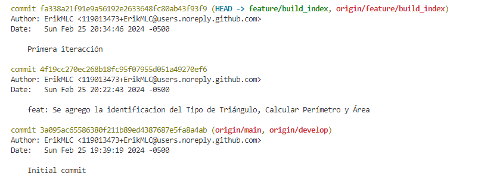
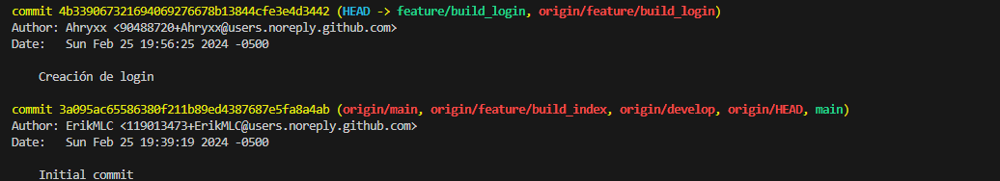
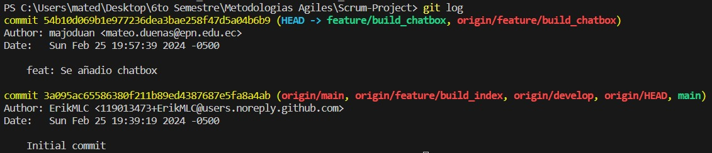

# REPOSITORIO DE GITHUB

Enlace al [repositorio](https://github.com/leoandy23/TraductorKichwa)

# COLABORADORES

- [Erik Chalacama](https://github.com/ErikMLC)
- [Mateo Dueñas](https://github.com/majoduan)
- [José Fuertes](https://github.com/Ahryxx)
  
# RAMAS

## RAMA MAIN

- Rama principal del proyecto

## RAMA DEVELOP

- Rama de desarrollo

## PRIMERA ITERACION

## SEGUNDA ITERACION

## Estadisticas GitHub

