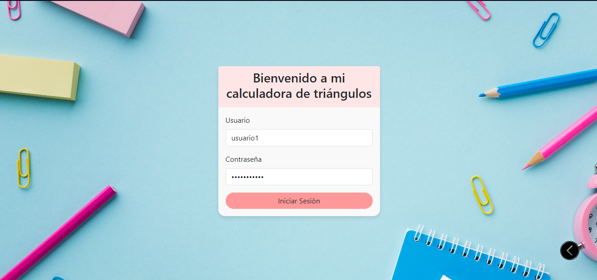
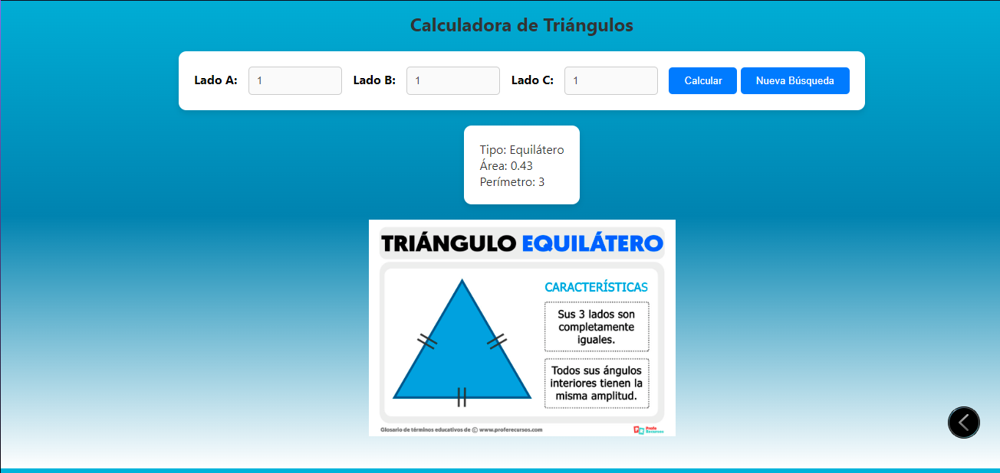
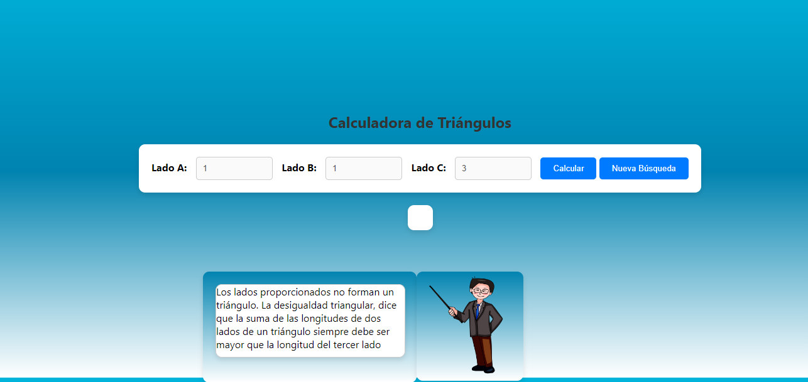

# Manual de Usuario - Aplicación Web de Consulta de Triángulos

## 1. Introducción
Esta aplicación proporciona una interfaz sencilla para calcular y visualizar información sobre triángulos, como el tipo (equilátero, isósceles, escaleno), el área y el perímetro.
Esta aplicación se ha desarrollado como parte de un proyecto educativo para ayudar a estudiantes y profesores a comprender mejor los conceptos de geometría y trigonometría.

## 2. Audiencia Objetivo
Este manual está diseñado para usuarios que deseen utilizar la aplicación web de consulta de triángulos. Se espera que los usuarios tengan conocimientos básicos de navegadores web y operación de aplicaciones en línea. Esta enfocado a ser usados por estudiantes y profesores de primaria.

## 3. Requisitos del Sistema
- Docker instalado en el sistema.
- Navegador web moderno (Google Chrome, Mozilla Firefox, Safari, etc.).
- Conexión a Internet.

## 4. Instalación
Siga estos pasos para instalar la aplicación:

1. Clone o descargue el repositorio desde [(https://github.com/ErikMLC/Proyecto-Scrum)].
2. Asegúrese de tener Docker instalado en su sistema.
3. Abra una terminal en la carpeta del proyecto.
4. Ejecute el siguiente comando para construir la imagen de Docker:

   ```bash
   docker build -t mi-aplicacion-web .
   ```

## 5. Ejecución
Después de la instalación, siga estos pasos para ejecutar la aplicación:

1. Ejecute el contenedor Docker con el siguiente comando:

   ```bash
   docker run --name mi-app-web -d -p 8080:80 mi-aplicacion-web
   ```

2. Abra su navegador web y visite [http://localhost:8080](http://localhost:8080).

## 6. Interfaz de Usuario
La interfaz de la aplicación consta de un formulario para ingresar las longitudes de los lados de un triángulo y un botón para consultar la información del triángulo.

## 7. Funcionalidades
- **Iniciar Sesión:**
  - La aplicación no requiere un inicio de sesión separado. Puede utilizarla directamente.

- **Consulta de Triángulo:**
  - Ingrese las longitudes de los lados en los campos proporcionados.
  - Haga clic en el botón "Consultar Triángulo" para calcular y mostrar el tipo, área y perímetro del triángulo.

- **Bot de Ayuda:**
    - La aplicación incluye un bot de ayuda que proporciona asistencia en caso de errores o preguntas frecuentes.
    - El bot aparecerá automáticamente si se detecta una entrada inválida o si el usuario solicita ayuda.

## 8. Consideraciones
- La aplicación utiliza Docker para facilitar la distribución y ejecución. Asegúrese de tener permisos para ejecutar contenedores Docker.

## 9. Limitaciones
- La aplicación actualmente solo admite triángulos con longitudes de lados válidas.

## 10. Solución de Problemas
En caso de problemas durante la instalación o ejecución, consulte la documentación de Docker y verifique los requisitos del sistema.

## 11. Contacto y Soporte
Si tiene preguntas o necesita asistencia, comuníquese con nuestro grupo de desarrollo en la exposicion planteada en clase.